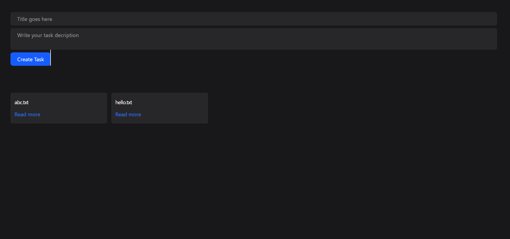
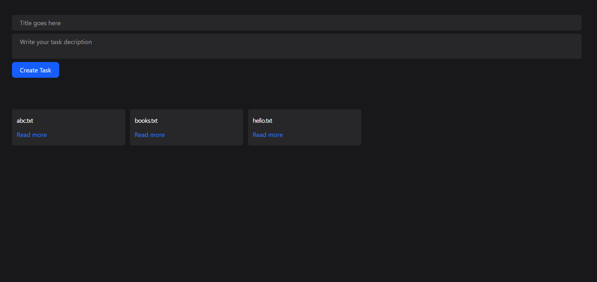
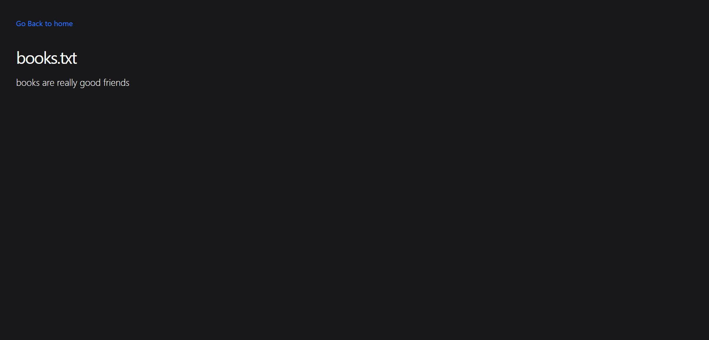

# 📝 Notes Web App

A simple and responsive **Notes Web Application** built using **Node.js**, **Express.js**, **EJS**, and the **File System (fs) module**. This project allows users to create, view, and manage notes while demonstrating server-side rendering and file-based data handling.

---

## 🚀 Features

* Create new notes
* View all saved notes
* Dynamic routing using Express
* Server-side rendering with EJS
* Store and retrieve notes using Node.js File System (`fs`) module
* Clean and responsive user interface

---

## 🛠️ Tech Stack

* **Node.js**
* **Express.js**
* **EJS**
* **HTML5**
* **CSS3**
* **JavaScript**
* **Node.js File System (fs) Module**

---

## 📚 What I Learned

This project helped me strengthen my backend development skills and understand how Express applications work.

Key concepts I learned include:

* Building a backend application using **Node.js**
* Creating web servers with **Express.js**
* Understanding and implementing **dynamic routing**
* Rendering dynamic pages using **EJS templates**
* Reading and writing files using the **Node.js File System (fs) module**
* Handling HTTP requests and responses
* Organizing an Express project structure
* Working with middleware
* Serving static files
* Processing form data
* Managing routes and views efficiently

---

## 📂 Project Structure

```text
Notes Web App/
│── files/
│── public/
│   ├── css/
│   └── js/
│── views/
│── index.js
│── package.json
│── README.md
```

---

## ⚙️ Installation

1. Clone the repository

```bash
git clone https://github.com/vanishreeganagi7777-bit/Notes_Web_App.git
```

2. Navigate to the project folder

```bash
cd Notes_Web_App
```

3. Install dependencies

```bash
npm install
```

4. Start the application

```bash
node index.js
```

5. Open your browser and visit:

```text
http://localhost:3000
```

---

## 📸 Screenshots

### Home Page

> Add your screenshot here

```text
images/home-page.png
```

---

### Create Note

> Add your screenshot here







## 🎯 Future Improvements

* Edit existing notes
* Delete notes
* Search functionality
* User authentication
* Database integration using MongoDB
* Rich text editor
* Responsive enhancements

---

## 👩‍💻 Author

**Vanishree Ganagi**

GitHub: https://github.com/vanishreeganagi7777-bit

LinkedIn: https://www.linkedin.com/in/vanishree-ganagi

---

## ⭐ Acknowledgements

This project was built as a learning exercise to improve my understanding of backend web development using **Node.js**, **Express.js**, **EJS**, and the **File System (fs) module**.
